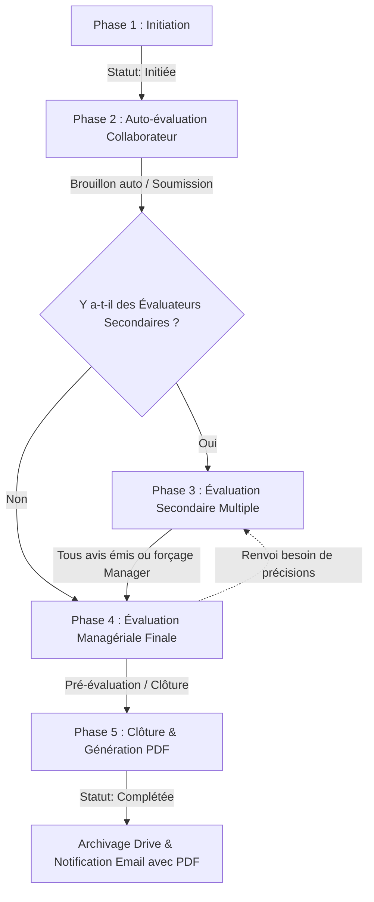

# 📋 KANAGA CONSULTING — RAPPORT TECHNIQUE & FEUILLE DE ROUTE DES ÉVOLUTIONS

> **Document de référence pour le pilotage, l'optimisation et les futures mises à jour du Portail d'Évaluation Kanaga.**  
> *Dernière mise à jour : Octobre 2026*  
> *Version du document : 1.0.0*

---

## 📑 Sommaire
1. [Fiche d'Identité du Projet & Environnements](#1-fiche-didentité-du-projet--environnements)
2. [Cartographie de l'Architecture Actuelle](#2-cartographie-de-larchitecture-actuelle)
3. [Cycle de Vie & Workflow d'Évaluation](#3-cycle-de-vie--workflow-dévaluation)
4. [Analyse Critique & Plan Stratégique d'Améliorations](#4-analyse-critique--plan-stratégique-daméliorations)
   - [Chantier 1 : Modularisation & Découpage du Code](#chantier-1--modularisation--découpage-du-code-priorité-haute)
   - [Chantier 2 : Performance & Gestion des Quotas Apps Script](#chantier-2--performance--gestion-des-quotas-apps-script-priorité-haute)
   - [Chantier 3 : Concurrence & Intégrité des Données (LockService)](#chantier-3--concurrence--intégrité-des-données-lockservice-priorité-haute)
   - [Chantier 4 : Sécurité & Contrôle d'Accès Côté Serveur](#chantier-4--sécurité--contrôle-daccès-côté-serveur-priorité-moyenne)
   - [Chantier 5 : Résilience Offline & UX Frontend](#chantier-5--résilience-offline--ux-frontend-priorité-moyenne)
   - [Chantier 6 : Automatisation CI/CD & Tests Unitaires](#chantier-6--automatisation-cicd--tests-unitaires-priorité-évolution)
5. [Guide Pratique pour les Futures Mises à Jour](#5-guide-pratique-pour-les-futures-mises-à-jour)
6. [Checklist Pré-Déploiement en Production](#6-checklist-pré-déploiement-en-production)
7. [Journal des Mises à Jour (Changelog)](#7-journal-des-mises-à-jour-changelog)

---

## 1. Fiche d'Identité du Projet & Environnements

| Élément | Valeur / Identifiant | Notes |
|---|---|---|
| **Projet Google Apps Script** | `13SutwXPTMEdEpQl0EbojEyS-8CxVy_NHpY65SVRthpii8wraRMxAIogM` | [Éditeur GAS](https://script.google.com/u/0/home/projects/13SutwXPTMEdEpQl0EbojEyS-8CxVy_NHpY65SVRthpii8wraRMxAIogM/edit) |
| **Base de Données Google Sheets** | `1WjsYi4GQsYyHa-LlCzg6FOr4qv9EPM7X8f6vM8aLSmQ` | Contient les onglets `Evaluations`, `EvaluationQuestions`, `Users`, `Logs` |
| **ID Déploiement Fixe (Prod)** | `AKfycbxeoDfu8Uh9plmQXjud3N1cXUBmSAaIpgdrXQxgWEnp1jst3K3N2puD1pF3zl1XYsRntA` | Configuré dans [deploy.js](file:///c:/Users/Mahamane/Documents/Project/New_Kanaga-Portail-evaluation/deploy.js) |
| **URL Permanente Publique** | [Lien Portail Fixe](https://script.google.com/macros/s/AKfycbxeoDfu8Uh9plmQXjud3N1cXUBmSAaIpgdrXQxgWEnp1jst3K3N2puD1pF3zl1XYsRntA/exec) | **Ne change jamais** lors des déploiements |
| **Dépôt Git GitHub** | `https://github.com/Maitre-Mad/New-Kanaga-Portail-Evaluation.git` | Branche principale : `main` |

---

## 2. Cartographie de l'Architecture Actuelle

### Architecture Globale
```
+-------------------------------------------------------------+
|                      Navigateur Client                      |
|  - index.html (Conteneur principal & navigation)            |
|  - stylesheet.html (Thème Kanaga, animations, responsive)   |
|  - javascript.html (Logique métier, wizard, draft autosave) |
+------------------------------+------------------------------+
                               | google.script.run (RPC Asynchrone)
                               v
+-------------------------------------------------------------+
|               Google Apps Script Engine (V8)                |
|  - Code.js (3 900+ lignes : Auth, Evaluation, Mail, Logs)   |
|  - CreateReportDoc.js (Génération Google Docs & export PDF)  |
+------------------------------+------------------------------+
                               |
         +---------------------+---------------------+
         v                                           v
+-------------------------------+             +-----------------------+
|  Google Sheets (Base Données) |             |  Services Externes    |
|  - Evaluations                |             |  - GmailApp           |
|  - EvaluationQuestions        |             |  - DriveApp           |
|  - Users / Logs / Config      |             |  - DocumentApp (PDF)  |
+-------------------------------+             +-----------------------+
```

### Inventaire des Fichiers et Rôles

* [Code.js](file:///c:/Users/Mahamane/Documents/Project/New_Kanaga-Portail-evaluation/Code.js) : Coeur serveur — points d'entrée `doGet`, vérification des sessions, lecture/écriture des évaluations, notifications e-mails et déclencheurs temporels.
* [javascript.html](file:///c:/Users/Mahamane/Documents/Project/New_Kanaga-Portail-evaluation/javascript.html) : Script client — moteur de rendu dynamique de l'entonnoir (wizard en 4 étapes), calcul de la note globale, sauvegarde automatique des brouillons, modales et barre de progression.
* [stylesheet.html](file:///c:/Users/Mahamane/Documents/Project/New_Kanaga-Portail-evaluation/stylesheet.html) : Design system Kanaga — palette institutionnelle (#7C4C26), classes utilitaires, animations douces, responsive design et modales.
* [evaluation.html](file:///c:/Users/Mahamane/Documents/Project/New_Kanaga-Portail-evaluation/evaluation.html) : Template HTML de l'interface d'évaluation — barre de progression, formulaires par étapes, tableau de bord des évaluations et bouton flottant de barème.
* [admin.html](file:///c:/Users/Mahamane/Documents/Project/New_Kanaga-Portail-evaluation/admin.html) : Espace d'administration — Form Builder des profils métiers et questions, paramétrage des relances automatiques et templates d'e-mails.
* [CreateReportDoc.js](file:///c:/Users/Mahamane/Documents/Project/New_Kanaga-Portail-evaluation/CreateReportDoc.js) : Moteur de génération automatique de document Google Docs formaté puis converti en PDF pour l'archivage dans Google Drive.
* [deploy.js](file:///c:/Users/Mahamane/Documents/Project/New_Kanaga-Portail-evaluation/deploy.js) : Script Node.js de déploiement sécurisé avec mise à jour automatique de l'ID de version sans modifier l'URL permanente.

---

## 3. Cycle de Vie & Workflow d'Évaluation

Le processus d'évaluation suit 5 états stricts et traçables :



### Le Barème de Notation Harmonisé
Le barème est standardisé sur l'ensemble de l'application et supporte la rétrocompatibilité complète des sigles :

| Sigle Canonique | Intitulé | Note Numérique | Signification |
|---|---|---|---|
| `5 - EXCEPTI` | Performance Exceptionnelle | **5 / 5** | Dépasse constamment les attentes ; référence absolue. |
| `4 - SUPERIE` | Performance Supérieure | **4 / 5** | Dépasse régulièrement les attentes dans les domaines clés. |
| `3 - CONFORM` | Conforme aux Attentes | **3 / 5** | Atteint les objectifs et standards attendus du poste. |
| `2 - AMELIOR` | À Améliorer | **2 / 5** | N'atteint pas toujours les objectifs ; progression requise. |
| `1 - INSATIS` | Insatisfaisante | **1 / 5** | Objectifs non atteints ; plan d'action immédiat requis. |
| `NONAPPL` | Non Applicable | *Exclu du calcul* | Non applicable au profil ou à la période. |

---

## 4. Analyse Critique & Plan Stratégique d'Améliorations

### Chantier 1 : Modularisation & Découpage du Code (Priorité Haute)

* **Problématique actuelle :**
  [`Code.js`](file:///c:/Users/Mahamane/Documents/Project/New_Kanaga-Portail-evaluation/Code.js) dépasse **3 900 lignes** et [`javascript.html`](file:///c:/Users/Mahamane/Documents/Project/New_Kanaga-Portail-evaluation/javascript.html) dépasse **7 000 lignes**. Tout changement comporte un risque d'effet de bord et complique la revue de code.
* **Solution à implémenter lors des futures MAJ :**
  1. **Découpage côté Apps Script :** Dans Google Apps Script, tous les fichiers `.js` partagent le même contexte global. Il est recommandé de séparer `Code.js` en :
     * `AuthService.js` : Sessions, tokens, rôles et authentification.
     * `EvaluationService.js` : Calcul des notes, workflow, transitions de statuts.
     * `QuestionsService.js` : Lecture et écriture de l'onglet `EvaluationQuestions`.
     * `ReminderService.js` : Déclencheurs quotidiens et relances automatiques.
     * `NotificationService.js` : Modèles d'emails et envois GmailApp.
  2. **Découpage côté Frontend :**
     * Scinder [`javascript.html`](file:///c:/Users/Mahamane/Documents/Project/New_Kanaga-Portail-evaluation/javascript.html) en plusieurs sous-fichiers inclus via `<?!= include('js_evaluation_wizard') ?>`, `<?!= include('js_admin') ?>`, `<?!= include('js_dashboard') ?>`.

---

### Chantier 2 : Performance & Gestion des Quotas Apps Script (Priorité Haute)

* **Problématique actuelle :**
  Chaque requête utilisateur exécute `SpreadsheetApp.openById(SPREADSHEET_ID)` et parcourt les données feuille par feuille. Google applique des quotas d'exécution (6 minutes max par requête, temps CPU total quotidien).
* **Solution à implémenter lors des futures MAJ :**
  1. **Mise en cache serveur (`CacheService`) :**
     Mettre en cache les données quasi-statiques (arborescence des questions, profils de postes, liste des utilisateurs actifs) pour une durée de 15 à 30 minutes :
     ```javascript
     function getCachedEvaluationQuestions() {
       const cache = CacheService.getScriptCache();
       const cached = cache.get("EVAL_QUESTIONS_JSON");
       if (cached) return JSON.parse(cached);
       
       const questions = loadQuestionsFromSheet(); // appel réel à Sheets
       cache.put("EVAL_QUESTIONS_JSON", JSON.stringify(questions), 1800); // 30 min
       return questions;
     }
     ```
  2. **Invalidation ciblée du cache :**
     Dès qu'un administrateur modifie une question dans le Form Builder, vider explicitement la clé de cache (`cache.remove("EVAL_QUESTIONS_JSON")`).
  3. **Batching des lectures :**
     Remplacer tout accès unitaire `sheet.getRange(row, col).getValue()` par un chargement en bloc via `sheet.getDataRange().getValues()`.

---

### Chantier 3 : Concurrence & Intégrité des Données (LockService) (Priorité Haute)

* **Problématique actuelle :**
  Aucun verrou n'est posé lors de la mise à jour des évaluations. Si deux évaluateurs secondaires sauvegardent au même instant, ou si un manager clôture pendant qu'un brouillon se synchronise, un écrasement silencieux de ligne peut survenir.
* **Solution à implémenter lors des futures MAJ :**
  Encapsuler toutes les écritures critiques dans `LockService` :
  ```javascript
  function saveEvaluationWithLock(evaluationData) {
    const lock = LockService.getScriptLock();
    // Attente maximale de 10 secondes pour acquérir le verrou
    const success = lock.tryLock(10000);
    if (!success) {
      throw new Error("Le serveur est actuellement sollicité. Veuillez réessayer dans quelques secondes.");
    }
    try {
      // Exécution de l'écriture sécurisée dans Google Sheets
      return executeEvaluationSave(evaluationData);
    } finally {
      lock.releaseLock();
    }
  }
  ```

---

### Chantier 4 : Sécurité & Contrôle d'Accès Côté Serveur (Priorité Moyenne)

* **Problématique actuelle :**
  Certaines fonctions vérifient l'existence d'une session, mais ne valident pas systématiquement que le collaborateur appelant a bien le droit de lire ou modifier l'évaluation passée en paramètre (risque de faille IDOR).
* **Solution à implémenter lors des futures MAJ :**
  1. **Fonction de validation d'habilitation centralisée :**
     ```javascript
     function assertCanAccessEvaluation(sessionUser, evalRecord) {
       const userEmail = sessionUser.email.toLowerCase();
       const userRole = (sessionUser.role || '').toLowerCase();
       if (userRole === 'admin' || userRole === 'superadmin') return true;
       if (evalRecord.employeEmail.toLowerCase() === userEmail) return true;
       if (evalRecord.evaluateurPrincipalEmail.toLowerCase() === userEmail) return true;
       if ((evalRecord.evaluateursSecondaires || '').toLowerCase().includes(userEmail)) return true;
       throw new Error("Accès non autorisé à cette évaluation.");
     }
     ```
  2. **Gestion des secrets :** Déplacer toute clé API, ID de dossier sensible ou webhook vers `PropertiesService.getScriptProperties()` plutôt que des valeurs écrites en clair.

---

### Chantier 5 : Résilience Offline & UX Frontend (Priorité Moyenne)

* **Problématique actuelle :**
  Si la connexion Internet est coupée pendant qu'un collaborateur rédige une longue argumentation d'évaluation, la sauvegarde automatique côté serveur peut échouer silencieusement.
* **Solution à implémenter lors des futures MAJ :**
  1. **Sauvegarde locale synchrone (`localStorage`) :**
     À chaque frappe de touche dans le wizard, stocker les réponses dans `localStorage.setItem('kanaga_eval_draft_' + evalId, JSON.stringify(formData))`.
  2. **Indicateur de statut clair :**
     Ajouter un widget d'état discret en bas de page :
     * 🟢 *"Brouillon synchronisé sur le serveur"*
     * 🟡 *"Enregistrement en cours..."*
     * 🔴 *"Hors-ligne : vos modifications sont sécurisées localement sur votre appareil"*

---

### Chantier 6 : Automatisation CI/CD & Tests Unitaires (Priorité Évolution)

* **Problématique actuelle :**
  Le déploiement repose sur une commande manuelle locale (`node deploy.js`).
* **Solution à implémenter lors des futures MAJ :**
  * **GitHub Actions Workflow :** Configurer un fichier `.github/workflows/deploy.yml` qui exécute automatiquement les tests et déclenche `clasp push` + `clasp deploy` sur push sur `main`.
  * **Tests unitaires (Jest) :** Tester automatiquement les fonctions pures (calcul de la note globale, normalisation des sigles du barème, interpolation des balises d'e-mails).

---

## 5. Guide Pratique pour les Futures Mises à Jour

Pour toute modification ultérieure sur le projet, suivre scrupuleusement ces étapes :

### Étape 1 : Récupérer la dernière version
```powershell
git pull origin main
npx clasp pull
```

### Étape 2 : Effectuer les développements
* Respecter la convention de nommage et la charte graphique Kanaga.
* Éviter les emojis dans les boutons et les composants professionnels.
* Tester localement les éventuelles modifications CSS / JS.

### Étape 3 : Valider et commiter sur Git
```powershell
git add -A
git commit -m "feat(ou fix): description claire des changements"
git push origin main
```

### Étape 4 : Déployer en Production sur l'URL Permanente
Exécuter le script dédié :
```powershell
node deploy.js "Description de votre mise à jour"
```
*Le script effectue automatiquement `clasp push` et redéploie sur le déploiement fixe sans modifier l'URL fournie aux utilisateurs.*

---

## 6. Checklist Pré-Déploiement en Production

Avant chaque mise en production, cocher impérativement les points suivants :

- [ ] **Rétrocompatibilité des Données :** La modification casse-t-elle le format des colonnes de la feuille Google Sheets ?
- [ ] **Barème de Notation :** Les sigles utilisés sont-ils conformes (`5 - EXCEPTI`, `4 - SUPERIE`, `3 - CONFORM`, `2 - AMELIOR`, `1 - INSATIS`, `NONAPPL`) ?
- [ ] **Gestion des Droits :** Un collaborateur peut-il accéder aux données d'un autre utilisateur sans y être autorisé ?
- [ ] **Affichage Mobile & Desktop :** Le formulaire s'affiche-t-il correctement sur écran large et sur smartphone ?
- [ ] **Génération PDF :** L'export du compte-rendu PDF fonctionne-t-il toujours sans erreur DocumentApp ?
- [ ] **E-mails & Balises :** Toutes les variables dynamiques (`{nom_employe}`, `{lien_portail}`, etc.) sont-elles correctement renseignées ?

---

## 7. Journal des Mises à Jour (Changelog)

| **05/10/2026** | `38c753b` | Équipe Projet | • Barre de progression dynamique avec répartition par sections.<br>• Bouton flottant et modale accessible pour le barème de notation.<br>• Épuration visuelle professionnelle (suppression des emojis dans l'UI).<br>• Script de déploiement à URL permanente (`deploy.js`).<br>• Normalisation et rétrocompatibilité totale des sigles de notation. |
| **05/10/2026** | `v1.0.1` | Équipe Projet | • **Correction critique de routage :** Fonction `matchConclusionField` fiabilisant la détection des objectifs de la période suivante (`smartGoals`) quelle que soit la formulation (avec ou sans « SMART »).<br>• **Suppression de la collision :** Les objectifs futurs ne sont plus jamais écrasés ni envoyés dans les *Commentaires Généraux Manager*.<br>• **Harmonisation des libellés :** Intitulé explicite « Objectifs de la Période Suivante (SMART) » dans le visualiseur et le PDF.<br>• Protection contre les verrous de fichiers Office dans le script de génération Word. |
| **05/10/2026** | `v1.0.2` | Équipe Projet | • **Correction affichage Conclusion (Auto-évaluation) :** Pour les questions ouvertes/textuelles (bilan des missions, points forts, etc.), la réponse de l'évalué s'affiche désormais directement dans le bloc de réponse avec retours à la ligne respectés, plutôt que d'être tronquée dans un badge de note.<br>• **Nettoyage des préfixes :** Suppression des mentions redondantes « Commentaire : » devant les réponses du collaborateur. |
| **05/10/2026** | `v1.0.3` | Équipe Projet | • **Nouvelle Boîte d'Alerte Globale Responsive :** Remplacement de la boîte `alert()` native du navigateur par une modale sur-mesure aux couleurs Kanaga.<br>• **Disparition du lien technique :** Plus aucune mention de l'URL Google Script (`script.googleusercontent.com`).<br>• **Design adaptatif :** Dimensions et typographies dynamiques (`clamp()`) s'adaptant à la taille de l'écran, avec flou d'arrière-plan (`backdrop-filter`), icônes contextuelles (Attention / Erreur / Succès / Info) et raccourcis clavier (`Entrée` / `Échap`). |
| **05/10/2026** | `v1.0.4` | Équipe Projet | • **Intégration Complète de la Section 3 dans la Fiche Finale :** Ajout des lignes manquantes « Travaux & Missions (Période écoulée) » (`pastGoals`) et « Aspirations Professionnelles » (`aspirations`) dans le tableau de Synthèse Globale du visualiseur et du PDF officiel.<br>• **Prise en compte des 3 niveaux d'évaluation :** Restitution synchronisée des réponses collaborateur, évaluateurs secondaires et principal. |
| **05/10/2026** | `v1.0.5` | Équipe Projet | • **Réouverture & Modification Administrateur :** Capacité pour les administrateurs de réouvrir n'importe quel dossier complété via les boutons « Réouvrir (Admin) ».<br>• **Navigation Libre sans Remplissage Obligatoire :** Désactivation des blocages et contrôles obligatoires lors de la navigation entre les pages (pills et boutons Suivant) et sections en mode administrateur.<br>• **Boîte de Dialogue & Bannière d'Avertissement :** Notification informative à l'ouverture expliquant l'utilisation du rôle administrateur et affichage d'un bandeau visuel distinctif dans le wizard.<br>• **Accès Direct par Onglet :** Déverrouillage des onglets du wizard pour navigation directe par clic. |
| **05/10/2026** | `v1.0.6` | Équipe Projet | • **Repositionnement Performance Globale en Question 1 :** L'appréciation de la performance générale passe en première question (« 1. Appréciation de la Performance Globale ») de la Section 3 (Conclusion), avec réordonnancement automatique des questions suivantes sur la Page 1.<br>• **Choix Multiple avec Champ Commentaire :** La question de performance globale adopte le format barème à choix multiples (`EXCEPTI`, `SUPERIE`, `CONFORM`, `AMELIOR`, `INSATIS`, `NONAPPL`) tout en intégrant un champ commentaire dédié.<br>• **Rétrocompatibilité Totale des Réponses Antérieures :** Les réponses textuelles déjà enregistrées dans la base sont automatiquement reconnues et chargées dans le champ commentaire du collaborateur/manager sans aucune perte d'information.<br>• **Résumé des Notes Attribuées :** Intégration d'une carte récapitulative dynamique (titre épuré sans icône) recensant le décompte exact des notes attribuées dans les Sections 1 & 2 avec vue comparative collaborateur/manager. |
| *Prochaine MAJ* | *v1.1.0* | — | *Mise en place de `LockService` et mise en cache `CacheService`.* |

---
*Ce rapport constitue la référence officielle du projet. À mettre à jour à chaque palier de version majeur.*

